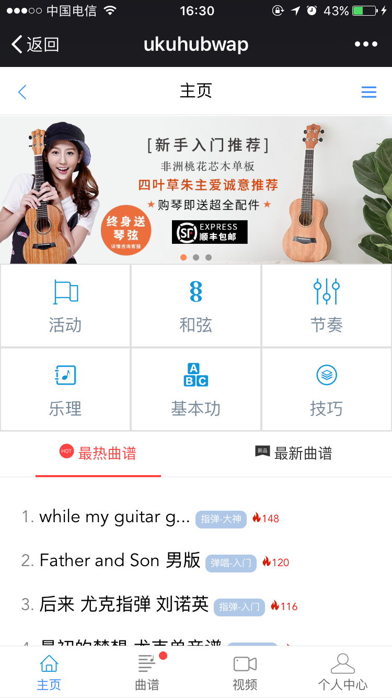

# ukuhubwap

> ukuhub项目的Web app部分

> 涉及到的 vue相关技术： 

> vuex                   state管理

> vue-Router             vue路由

> vue-Resource           http请求 (支持拦截器)

> vuex-along             state持久化 解决页面刷新丢失state (作为vuex插件使用) 

> vuex-router-sync       将router状态放入vuex进行管理

> vant-ui                移动端 web组件库

> vue-navigation         导航缓存 (前进刷新 后退不刷新)

> fastclick              移动端双击

> date-fns               日期函数库


## 项目截图



## Build Setup

``` bash
# install dependencies
npm install

# serve with hot reload at localhost:8080
npm run dev

# build for production with minification
npm run build

# build for production and view the bundle analyzer report
npm run build --report

# run unit tests
npm run unit

# run all tests
npm test
```

For a detailed explanation on how things work, check out the [guide](http://vuejs-templates.github.io/webpack/) and [docs for vue-loader](http://vuejs.github.io/vue-loader).
